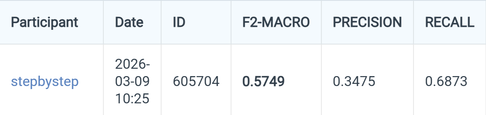
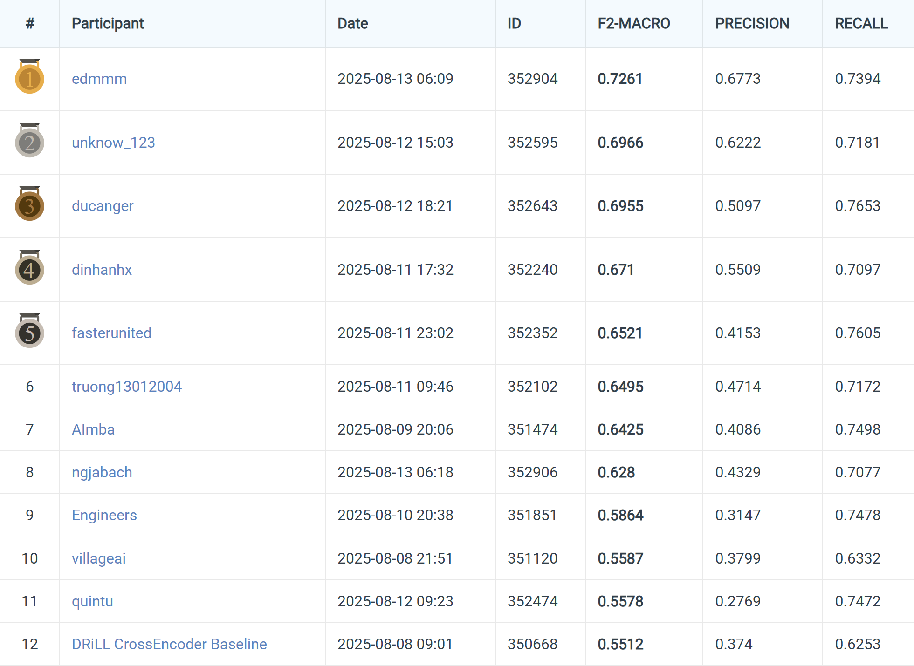

# Notebook Descriptions

A 5-step pipeline for solving DRiLL-VLSP2025.

## My solution result:

## Other results:

| File | Role |
|------|------|
| `eda_and_chunk_corpus.ipynb` | **Corpus Preprocessing & EDA** — Word segmentation with VnCoreNLP, chunking legal articles into segments of ≤256 tokens (overlap 64) using PhoBERT tokenizer, and analysis of sentence/query length distributions. |
| `vnese_biencoder_ft_val.ipynb` | **Bi-encoder Fine-tuning** — Fine-tunes the Vietnamese Bi-encoder on the full training set with validation split (train : val = 9 : 1), then uses the fine-tuned model to mine hard negatives for the reranker. Trained on Kaggle **P100**. |
| `vnese_biencoder_ft_no_val.ipynb` | **Candidate Retrieval (top-200 → top-100)** — Retrieves the best 200 candidates by combining BM25 and the Vietnamese Bi-encoder fine-tuned on the full training set without validation split, then applies raw `bge-reranker-v2-m3` to narrow down to the top-100 results. Trained on Kaggle **P100**. |
| `ft-reranker.ipynb` | **Reranker Fine-tuning & Final Filtering** — Uses the fine-tuned Bi-encoder from `vnese_biencoder_ft_val.ipynb` to mine hard negatives, fine-tunes `bge-reranker-v2-m3` on them, then applies the fine-tuned reranker to filter the top-100 candidates from `vnese_biencoder_ft_no_val.ipynb` down to the final **top-10** results. Trained on Kaggle **P100**. |
| `judge_top10_LLM.ipynb` | **LLM-based Evaluation** — Uses `qwen2.5-14b-instruct` via Ollama on **2× T4 GPUs** (parallel inference) to judge the quality of top-10 results produced by the reranker. |
